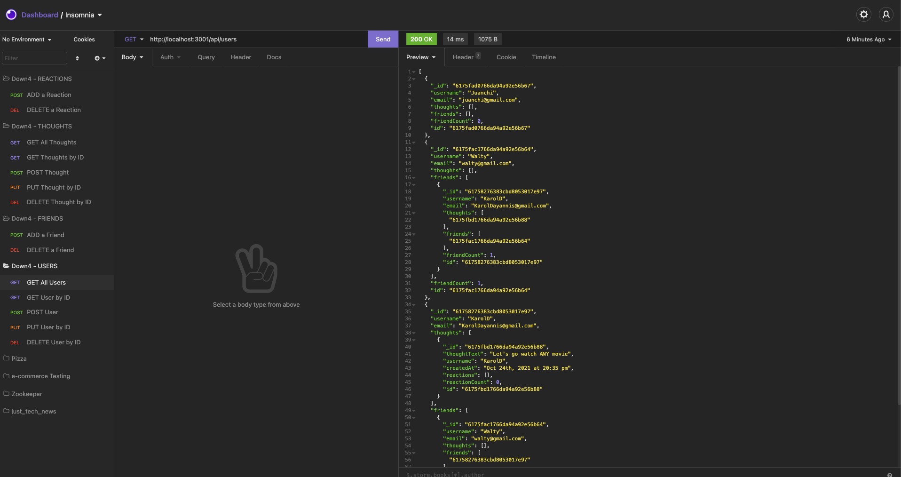
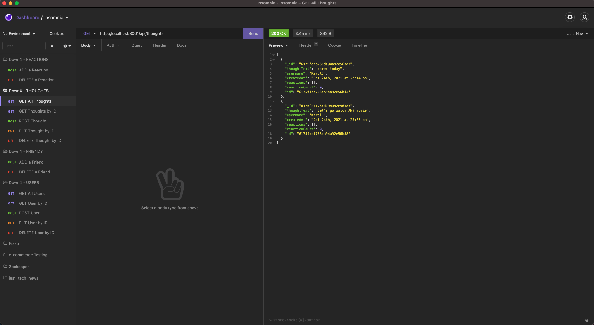
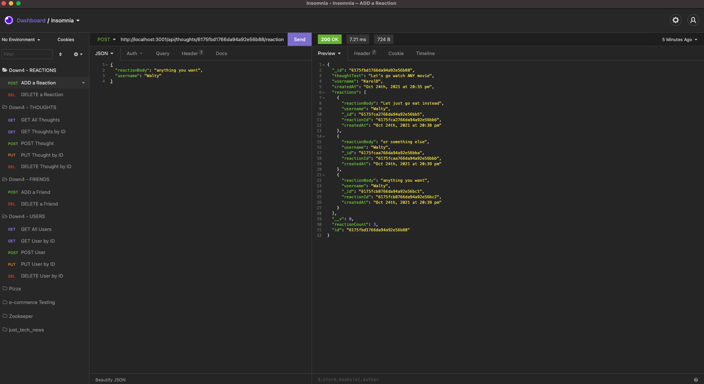
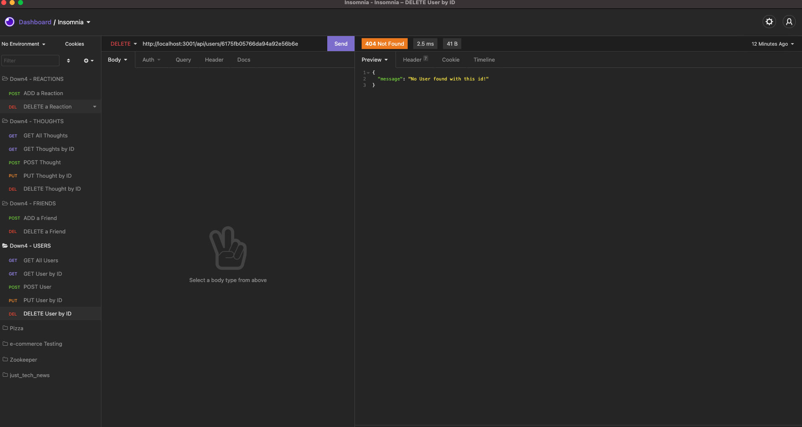

# Down4-social-network

[](https://opensource.org/licenses/Artistic-2.0)

## Description
An application where you can network and connect with friends all around the world!
Time to mingle virtually

## Table of Contents

* [Installation](#installation)
* [Demo](#demo)
* [Deployment](#deployment)
* [Usage](#usage)
* [License](#license)
* [Contribution](#contribution)
* [Questions](#questions)


## Installation

1. You must download and install Node.js click on link: https://nodejs.org/en/download/

2. Download and install MongoDB depending on your operating system. Click on the Link below:
https://www.mongodb.com/try/download/community

Guide for Windows: https://docs.mongodb.com/manual/tutorial/install-mongodb-on-windows/

Guide for Mac: https://docs.mongodb.com/manual/tutorial/install-mongodb-on-os-x/

3. copy or clone this repo into the folder where you want the application to be created by entering the following command in your terminal (mac) or gitbash (windows):
    * git clone git@github.com:walterlaw19/e-commerce-industry.git   (<---- Copy, Paste, Enter this command in your terminal)

4. Open the e-commerce-industry folder from your your VS Code (make sure you are in the right folder) or you can use the integrated terminal, go to the directory where the e-commerce-industry folder was installed: e.g. "cd e-commerce-industry"

5. Once you are in the e-commerce-industry folder, open a new file where you will put your credentials.  In the terminal type: 'touch .env'  Then navigate to .env file and open it and put this information 

```
DB_NAME='ecommerce_db'
DB_USER='root'
DB_PW='ThisIsMySQLPW'
```

*** You should enter your SQL username in DB_USER and your SQL password in DB_PW. Save the changes.

6. Back in the e-commerce-industry root directory, open your integrated terminal in VS Code and install the dependencies by entering the command: 'npm i'.  Wait for the installation to be completed.

7. After the installation has be completed, you must login to MySQL shell. Enter "msyql -u 'your SQL username' -p" and press Enter. Now you will be prompted to enter your SQL Password. Once you are logged in, enter the following commands in this order to clear/seed the MySQL database properly. 

```
A. source db/schema.sql
B. quit
```
8. First we must seed the database by entering the following command in the terminal: "npm run seed"

8. Once this is done, type "npm start" to run the application.

7. Use Insomnia to get all categories, tags and produces using the correct path

```
http://localhost:3001/api/products        http://localhost:3001/api/categories         http://localhost:3001/api/tags
```

9. Once you are done, you can press CTRL + C in the terminal to stop the application.


## Demo

 "GET All Users"
 "GET All Thoughts"
 "ADD a Reaction"
 "DELETE a User"


## Deployment

click here to view the application:
<!-- https://walt-first-tech-blog.herokuapp.com/ -->  ENTER NEW VIDEO LINK

## Usage

You can use this application to network
 
## License

[](https://opensource.org/licenses/MIT)

## contribution

Please send me an email if you can want to contribute or submit any suggestions: walterlaw19@gmail.com

## Questions

If you have any questions or concerns, you can reach me at: walterlaw19@gmail.com

or visit my GitHub: https://github.com/walterlaw19


```
Made by by Walter G
```

---
##### © 2021 WG.


